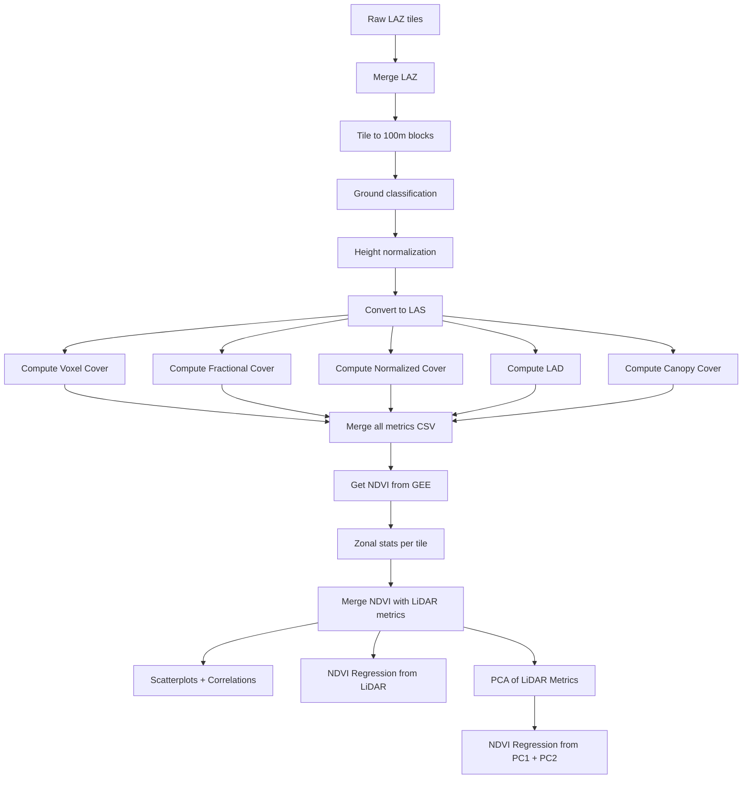

# Taal LiDAR Understory Mapping – Final Workflow

This project investigates the capacity of NDVI to reflect structural forest metrics derived from airborne LiDAR, particularly in the understory. The study uses LAStools and Python to extract, compute, and evaluate multiple LiDAR-based indicators of forest structure, and compares them against NDVI derived from Sentinel-2 imagery.

---

## 🎯 Research Questions

1. To what extent can LiDAR-derived metrics be used to characterize forest structural complexity, particularly in the understory layer?
2. How well does NDVI represent LiDAR-derived vegetation structural metrics across a forested study area?
3. Which LiDAR-derived structural components best explain NDVI variability?
4. Can principal component analysis reveal dominant structural patterns in LiDAR data, and how do these relate to NDVI?

---

## 🎯 Objectives

1. Preprocess airborne LiDAR data and extract height-normalized tiles at 100m resolution.
2. Compute LiDAR-derived canopy and understory metrics: voxel cover, LAD, fractional cover, normalized cover, and canopy cover.
3. Acquire and summarize 2017 NDVI data from Sentinel-2 for the same spatial extent.
4. Analyze NDVI–LiDAR relationships using correlation and regression.
5. Use PCA to simplify LiDAR metric space and model NDVI from principal components.

---

## 📁 Folder Structure

```
TAAL-LIDAR-UNDERSTORY/
├── data/
│   ├── normalized_las_100m/
│   ├── ndvi_mar_may_2017.tif
│   ├── tiles_100m.shp
│   ├── voxel_cover_metrics_100m.csv
│   ├── fractional_cover_metrics_100m.csv
│   ├── normalized_cover_metrics_100m.csv
│   ├── lad_metrics_100m.csv
│   ├── canopy_cover_metrics_dbh_100m.csv
│   ├── all_metrics_100m.csv
│   ├── ndvi_tile_stats_2017.csv
│   ├── all_metrics_with_ndvi_100m.csv
│   └── plots/
├── scripts/
│   └── [processing and analysis scripts]
└── README_FINAL_FULL.md
```

---

## 🧭 Workflow Diagram



---

## ✅ Summary of Methodology

### LiDAR Processing
- Merged and tiled .laz files
- Classified ground and normalized heights
- Converted to `.las` format for Python processing

### Structural Metric Extraction
- Computed voxel cover, fractional cover, normalized cover, LAD, and canopy cover per tile
- Merged into `all_metrics_100m.csv`

### NDVI Integration
- Retrieved 2017 Sentinel-2 NDVI via GEE (March–May)
- Performed zonal stats using tile shapefile
- Merged into `all_metrics_with_ndvi_100m.csv`

### Analysis
- Visualized NDVI vs. each LiDAR metric with correlation coefficients
- Built regression models to predict NDVI from LiDAR structure
- Applied PCA: PC1 (95.3%) dominated by LAD
- PCA-based NDVI regression: R² = 0.771

---

## 🧠 Key Insight

> NDVI, commonly interpreted as a canopy greenness index, was shown through PCA to be more aligned with **understory leaf area density** in this forest context. This suggests NDVI may partially reflect vertically layered forest complexity, but cannot substitute for LiDAR in detailed structural analysis.
