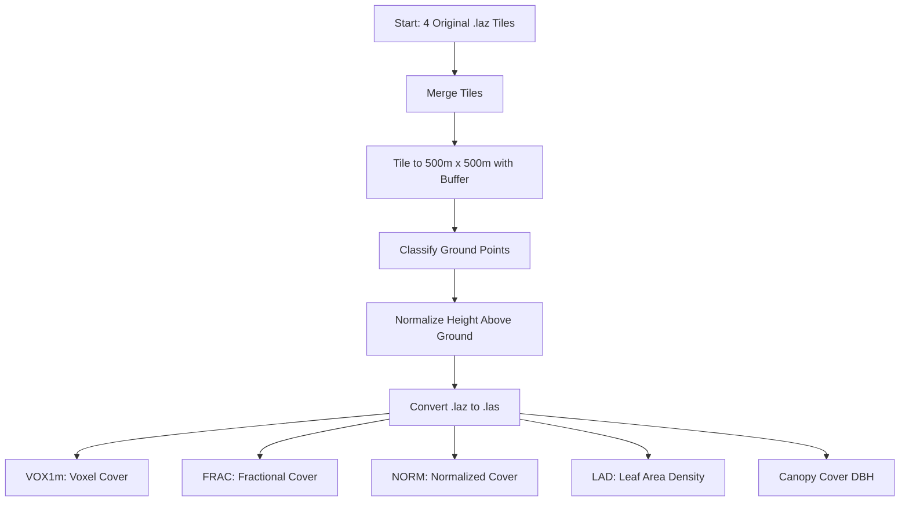

# LiDAR Understory Mapping Workflow (Taal Volcano Dataset)

This repository documents the LiDAR processing and analysis workflow for my undergraduate project, focused on evaluating LiDAR-derived understory structure metrics and their relationship with NDVI in a tropical forest setting.

## 🗺️ Study Area
- **Location**: Taal Volcano, Batangas, Philippines
- **Data**: Four 1km x 1km .laz tiles from the Taal open LiDAR dataset

## 📁 Folder Structure

```
TAAL-LIDAR-UNDERSTORY/
│
├── data/                             # All LiDAR-related input/output data
│   ├── tiles/                       # Tiled 500m x 500m versions of merged .laz
│   ├── ground_tiles/                # Ground-classified tiles (after lasground)
│   ├── normalized_tiles/            # Height-normalized tiles (after lasheight)
│   ├── normalized_las/              # Uncompressed .las files for Python compatibility
│   ├── voxel_cover_metrics.csv      # Output: voxel cover (VOX1m)
│   ├── fractional_cover_metrics.csv # Output: fractional cover
│   ├── normalized_cover_metrics.csv # Output: normalized cover
│   ├── lad_metrics.csv              # Output: leaf area density (mean in 0.5–3.5m)
│   ├── canopy_cover_metrics_dbh.csv # Output: DBH-standard canopy cover
│   └── (original .laz files)        # The 4 downloaded Taal tiles
│
├── scripts/                         # Python scripts for metric extraction
│   ├── compute_voxel_cover_debug_fixed.py
│   ├── compute_fractional_cover.py
│   ├── compute_normalized_cover.py
│   ├── compute_leaf_area_density.py
│   └── compute_canopy_cover_dbh_standard.py
│
├── env/                             # Python virtual environment (optional)
│
└── README.md                        # Documentation for the project
```

## 🧮 LAStools Preprocessing Commands

### 1. Merge Tiles
```bash
lasmerge -i data\tile1.laz data\tile2.laz data\tile3.laz data\tile4.laz -o data\merged_taal.laz
```

### 2. Tile the Merged Dataset into 500m x 500m Blocks
```bash
mkdir data\tiles
lastile -i data\merged_taal.laz -tile_size 500 -buffer 20 -o data\tiles\tile.laz
```

### 3. Classify Ground Points for Each Tile
```bash
mkdir data\ground_tiles
lasground -i data\tiles\*.laz -wilderness -odir data\ground_tiles -olaz
```

### 4. Normalize Height Above Ground for Each Tile
```bash
mkdir data\normalized_tiles
lasheight -i data\ground_tiles\*.laz -replace_z -odir data\normalized_tiles -olaz
```

### 5. Convert .laz to .las for Python Compatibility
```bash
mkdir data\normalized_las
las2las -i data\normalized_tiles\*.laz -olas -odir data\normalized_las
```

## 🧭 Workflow Diagram


