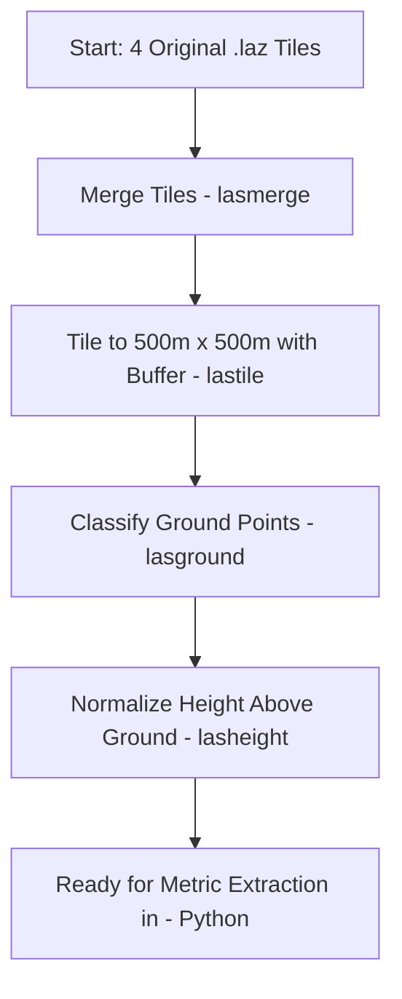

# LiDAR Understory Mapping Workflow (Taal Volcano Dataset)

This repository documents the LiDAR processing and analysis workflow for my undergraduate project, focused on evaluating LiDAR-derived understory structure metrics and their relationship with NDVI in a tropical forest setting.

## 🗺️ Study Area
- **Location**: Taal Volcano, Batangas, Philippines
- **Data**: Four 1km x 1km .laz tiles from open LiDAR dataset

## 📦 Folder Structure

```
data/
│
├── tiles/                 # Tiled versions of the merged dataset
├── ground_tiles/          # Ground-classified point clouds per tile
├── normalized_tiles/      # Height-normalized tiles (Z = height above ground)
├── merged_taal.laz        # Merged .laz from original 4 tiles
└── (original .laz tiles)  # The 4 raw .laz tiles from Taal
```

## 🧮 LAStools Preprocessing Commands

### 1. Merge Tiles
```bash
lasmerge -i data\tile1.laz data\tile2.laz data\tile3.laz data\tile4.laz -o data\merged_taal.laz
```

### 2. Tile the Merged Dataset into 500m x 500m Blocks
```bash
mkdir data\tiles
lastile -i data\merged_taal.laz -tile_size 500 -buffer 20 -o data\tiles\tile.laz
```

### 3. Classify Ground Points for Each Tile
```bash
mkdir data\ground_tiles
lasground -i data\tiles\*.laz -wilderness -odir data\ground_tiles -olaz
```

### 4. Normalize Height Above Ground for Each Tile
```bash
mkdir data\normalized_tiles
lasheight -i data\ground_tiles\*.laz -replace_z -odir data\normalized_tiles -olaz
```

> ✅ At this point, the data is fully normalized and ready for LiDAR-derived metric computation in Python (e.g., Voxel Cover, Fractional Cover, etc.).

---

## 🧭 Workflow Diagram


