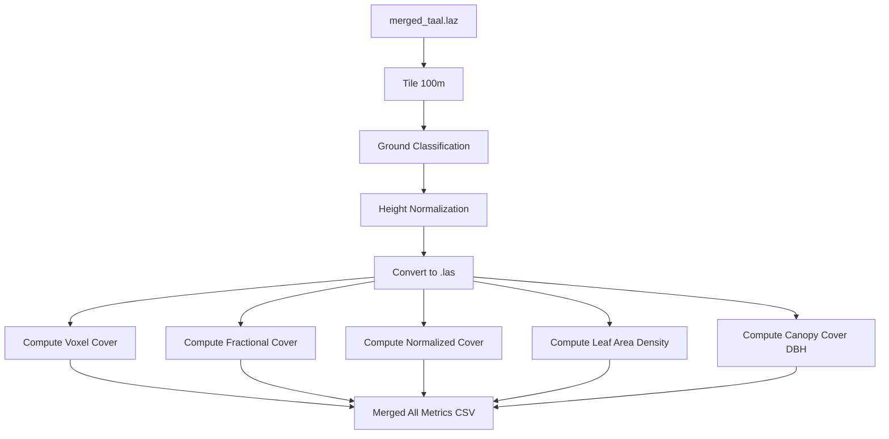

# LiDAR Understory Mapping Workflow (100m Tile Resolution)

This repository documents the processing and analysis workflow for a tile-based LiDAR vegetation structure assessment over Taal Volcano, Philippines. It replicates the core methodology of Venier et al. (2019), extended with a novel integration of NDVI as a remote proxy for field validation.

## 🗺️ Study Area
- **Location**: Taal Volcano, Batangas, Philippines
- **Tile Size**: 100m × 100m
- **Data**: Airborne LiDAR (.laz), open-access NDVI raster (to be integrated)

## 📁 Folder Structure

```
TAAL-LIDAR-UNDERSTORY/
│
├── data/
│   ├── tiles_100m/                        # 100m × 100m tiles of merged .laz
│   ├── ground_tiles_100m/                 # Ground-classified .laz tiles
│   ├── normalized_tiles_100m/             # Height-normalized .laz tiles
│   ├── normalized_las_100m/               # Converted to .las for Python processing
│   ├── voxel_cover_metrics_100m.csv       # Voxel cover
│   ├── fractional_cover_metrics_100m.csv  # Fractional cover
│   ├── normalized_cover_metrics_100m.csv  # Normalized cover
│   ├── lad_metrics_100m.csv               # Leaf area density (0.5–3.5m)
│   ├── canopy_cover_metrics_dbh_100m.csv  # Canopy cover (DBH-based, >1.37m)
│   └── all_metrics_100m.csv               # Merged CSV of all metrics
│
├── scripts/
│   ├── compute_voxel_cover.py
│   ├── compute_fractional_cover.py
│   ├── compute_normalized_cover.py
│   ├── compute_leaf_area_density.py
│   ├── compute_canopy_cover.py
│   └── merge_all_metrics.py
│
├── env/                                   # Python virtual environment (optional)
│
└── README.md
```

## 🧮 LAStools Preprocessing Commands (100m Tiles)

```bash
# 1. Tile the merged dataset
mkdir data\tiles_100m
lastile -i data\merged_taal.laz -tile_size 100 -buffer 20 -o data\tiles_100m\tile.laz

# 2. Classify ground points
mkdir data\ground_tiles_100m
lasground -i data\tiles_100m\*.laz -wilderness -odir data\ground_tiles_100m -olaz

# 3. Normalize height
mkdir data\normalized_tiles_100m
lasheight -i data\ground_tiles_100m\*.laz -replace_z -odir data\normalized_tiles_100m -olaz

# 4. Convert to .las for Python compatibility
mkdir data\normalized_las_100m
las2las -i data\normalized_tiles_100m\*.laz -olas -odir data\normalized_las_100m
```

## 🧭 Workflow Diagram



> Next step: Integrate Sentinel-2 NDVI to compare with LiDAR-derived metrics.
